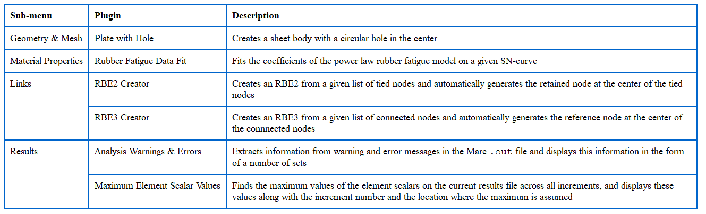

## Example 1 User Plugin

#### How to customize MSC Mentat

It is possible to customize MSC Mentat GUI in different ways and locations, such as in the Menu Bar, Toolbar, and Main Menu (Page Tab). 

The execution of procedure and python files can also be automated with user-defined buttons and popmenus.


#### User Plugins 

The Marc 2022.2 release introduces a new framework for creating plugins in Mentat. A plugin can extend the Mentat user interface by adding, for instance, a toolbar with icons to perform certain tasks or a popup menu in which the user can set some parameters and then click a button to perform a task. A task can be as simple as calling a Mentat command, or a more complex operation implemented in a procedure file or a Python script. 


In user-guide Highlights of Previous Releases 
a description of this funcionality is available



### Example 1 user1_plugin

Here is another basic example

This example plugin adds **an icon in the toolbar** and adds **an option inside the menubar**.

This user plugin **user1_plugin** changes the GUI to dark theme: this is a simple command recorded into a mentat procedure.
**user1_plugin.proc** changes interface to dark theme.


To define a user plugin it is important to pay attention to directory structure.

The files names for each plugin ([*plugin.ms*](plugin.ms), [*menubar.xml*](menubar.xml), and [*toolbars.xml*](toolbars.xml) ) should not be modified to work properly.

Please check the files in this folder to better understand how it works.

##### MSC MENTAT SYNTAX MENU
*Customizing the Menu Bar*
Edit the *menubar.xml* file located in *<Mentat\\_Installation\\_Dir>\menus\\*. Below is an example of a portion of the text code to be appended at the end of the file for the creation of a new menu bar named Utilities User 1:


```xml 
<menubar>
 <menu title="&amp;Utilities User 1">
    <popmenu title="User-Defined Menu User 1"
             popmenu="user_defined_popmenu"
             file="user.ms"/>
  </menu>
</menubar>
```

*Customizing the Toolbar*
Edit the *toolbars.xml* file located in *<Mentat\_Installation\_Dir>\menus\*. Below is an example of a portion of the text code to be appended at the end of the file for the creation of a new top toolbar icon named User 1 Toolbar, which in turn executes a procedure file to change the theme. The *<Mentat\_Installation\_Dir>* path should be updated accordingly in the .xml code file:

```xml 

  <toolbars>
      <toolbar name="User 1 Toolbar">
        <exec title="User 1 Toolbar"
              tooltip="Execute Procedure File user1_tb.proc"
              command='*exec_procedure "<Mentat_Installation_Dir>\menus\user1_tb.proc"'/>
      </toolbar>
  </toolbars>
```

*Customizing the Main Menu (Page Tabs)*
Edit the *main.xml* file located in *<Mentat\_Installation\_Dir>\menus\*. Below is an example of a portion of the text code to be appended at the end of the file for the creation of a new Main Menu Page named User 1, which in turn executes the same procedure code of the sample toolbar, or a python code that prints a test output in the Marc Mentat Dialog Window. The <Mentat\_Installation\_Dir> path should be updated accordingly in the .xml code file:

```xml 
  </page>
    <page title="User 1"
      name="user_1"
      >
      <!--nrows="1">-->
      <group title="Execute Files">
          <exec title="Run Procedure File #1"
            tooltip="Execute Procedure File user1_tb.proc"
            command='*exec_procedure "<Mentat_Installation_Dir>\menus\user1_tb.proc"'/>
          <exec title="Run Procedure File #2"
            tooltip="Execute Procedure File user1_mm.py"
            command='*py_file_run "<Mentat_Installation_Dir>\menus\user1_mm.py"'/>
      </group>
  </page>
```


Only in case the new user-defined options trigger a pop menu dialog box, then a .ms file should be created and edited accordingly. All files should be saved in the same folder where the .xml file resides. 

Before editing the installation files, it is strongly recommended that backup files are copied in case they are needed to be restored.

Make sure the attached files are downloaded and saved in the *<Mentat\_Installation\_Dir>\menus\* folder. For example: *C:\\Program Files\\MSC.Software\\Marc\\20xx\\mentat20xx\\menus\\* .


For further information about user plugins, please refer to the Mentat User’s Guide -> Basics of Mentat -> Mechanics of Mentat -> User Plugins.


[<-- go back home](../README.md)
[MSC Mentat Github repo](https://github.com/HexagonMI-DE-StructureCoE/Mentat-Procedures/tree/main)